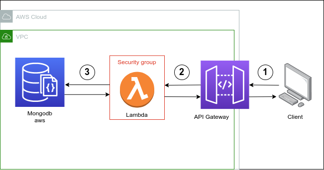
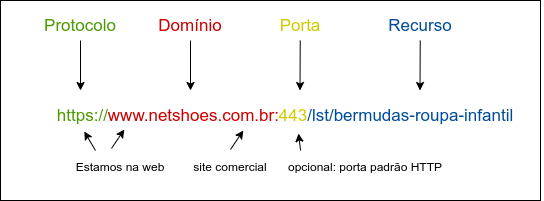

# API RESTful Sign in/Sign up

## Sumário
1. [Introdução](#Introdução)
2. [Instalação](#Instalação)
3. [Rotas](#Rotas)
4. [Requisitos](#Requisitos)
5. [Testes](#Testes)


## Introdução

O objetivo dessa aplicação é expor uma API RESTful de sign up/sign in e utilizar o token gerado para busca de CEP.


Pacotes principais:
- Express para criação das rotas e inicio do server.
- JWT para persistência do token por 30 minutos.
- Elephantsql para utilização do banco de dados NoSQL (MongoDB).
- Eslint para realização de testes.

## Instalação

Este projeto foi desenvolvido com a versão 14.7.4 do Nodejs.

Deve-se configurar as variáveis de ambiente .env

Exemplo: 

```
SECRET=XXXX
EXPIRESIN='30m'

DATABASE=teste
HOST=teste.db.elephantsql.com
PASSWORD=ahsgdhagdjad
```

Deve-se instalar as dependências utilizando:
```
npm install ou npm i
```

Para inicializar a aplicação: 
```
npm run dev
```

## Rotas/Endpoints

### Sign up
POST http://localhost:5000/signup

```java
{
   "email": "lauraxavier@teste.com.br",
   "senha": "123456"
}
```

-----

### Sign in
POST http://localhost:5000/signin

```java
{
   "email": "lauraxavier@teste.com.br",
   "senha": "123456"
}
```

-----

### CEP
PUT http://localhost:5000/cep/user_id

Exemplo
```java
{
   "cep": "05877241"
}
```

**Observação:** Será necessário preencher o user_id com o id do usuário que deseja obter as informações.
Também será preciso passar no header o parâmento authentication, utilizando a opção Token Bearer.
O user_id e token foram retornados na rota de sign-in. 

## Requisitos
Busca de CEP

- Dado um CEP válido, deve retornar o endereço correspondente.

- Dado um CEP válido, que não exista o endereço, deve substituir um dígito da direita para a esquerda por zero até que o endereço seja localizado (Exemplo: Dado 22333999 tentar com 22333990, 22333900 …).

- Dado um CEP inválido, deve retornar uma mensagem reportando o erro: "CEP inválido".

- Os serviços devem receber e responder JSON;

- Deve-se documentar a estratégia utilizada para a criação da aplicação, a arquitetura utilizada e os padrões. 

- Em caso de uso do Git/Bitbucket não esqueça de criar o .gitignore.
    
2. Extras:
- Preferencialmente use um versionador e faça commits granulares;
- Api com autorização;
- Boas práticas de design de api;
- Swagger com a documentação;
- Tecnologias preferenciais: java ou node.js - justifique, no readme a escolha da tecnologia.

```
Vantagens de uso da linguagem Node.js:

- Aplicações NodeJS utilizam single-thread, ou seja, uma thread denominada como Event Loop será responsável pela execução do código.

- Ao contrário de diversas linguagens de programação, cada chamada da aplicação ocorre de forma assíncrona, em outras palavras, não espera a finalização das outras threads para realizar a execução.

- Essa aplicação foi desenvolviva com a utilização do banco de dados MongoDB para armazenamento das informações. A linguagem Node.js é altamente indicada para esse caso, pois não é necessário preocupar-se com a conversão entre JSON e a gravação ou leitura em banco de dados.

Dado o serviço de busca de CEP proposto, entende-se que Node.js seria a melhor linguagem para essa aplicação pelas vantagens citadas acima. Além disso, vale ressaltar que a aplicação possui um ótimo desempenho e está preparada para receber muitas requisições, pelo uso do single-thread.

```

- logs estruturados;
- endpoint para saúde da aplicação;
- endpoint para métricas da aplicação;

- considere a performance do algoritmo e o tempo de resposta da aplicação, sabendo que a API  pode receber flutuações de tráfego agressivas.



```
Acima segue exemplo de infraestrutura que pode ser utilizada para essa aplicação.

1. O cliente realiza a requisição atráves do endpoint disponibilizado pelo API Gateway.

2. O API Gateway recebe a requisição e executa o script armazenado no lambda functions.

3. A aplicação lambda consulta os dados no mongoDB, de acordo com a necessidade da aplicação. 

4. O lambda retorna os valores para o api gateway e consequentemente para o usuário, de acordo com os parâmetros e padrões da requisição.

```


- Quando você digita a URL de um site (http://www.netshoes.com.br) no browser e pressiona enter, explique da forma que preferir, o que ocorre nesse processo do protocolo HTTP entre o Client e o Server.

```
Hypertext Transfer Protocol (HTTP) é um protocolo de comunicação, o qual possibilita que o usuário envie uma requisição e o servidor responda (Request-Response). Também é importante ressaltar que o HTTP é stateless, ou seja, o HTTP não armazena requisições anteriores enviadas para o servidor. 
```



```
Ao inserir a URL da imagem acima no browser, ocorre os seguintes passos:

1. A URL é recuperada e conecta-se a um servidor para encontrar o endereço IP do domínio correspondente.
Por exemplo: netshoes.com.br no servidor é encontrado como 201.95.254.67

2. O servidor retorna ao navegador a página com os dados e a conexão é fechada.


Cada requisição possui um método para indicar a ação desejada e receber determinado recurso. 
Sendo eles:

GET -> realiza solicitações apenas para recuperar dados.

HEAD -> uma resposta idêntica a uma solicitação GET, mas sem o corpo da resposta.

POST -> utilizado para criar documentos.

PUT -> realiza a atualização completa, ou seja, atualiza todos os dados de um documento.

DELETE -> remove um recurso específico, como um documento ou valor de um campo.

CONNECT -> estabelece um túnel para o servidor identificado pelo recurso de destino.

OPTIONS -> descreve as opções de comunicação HTTP suportadas.

TRACE -> retorna se houveram mudanças.

PATCH -> utilizado para aplicar modificações parciais em um documento.

O status code (códigos de status) indicam o retorno de uma requisição HTTP. As respostas são agrupadas em quatro classes, sendo elas:

2XX -> Respostas de sucesso.
3XX -> Mensagem de redirecionamento.
4XX -> Respostas de erro do cliente.
5XX -> Respostas de erro do servidor.

```

## Testes
Os testes foram realizados utilizando o Eslint.
O arquivo pode ser encontrado em -> .eslintrc.json